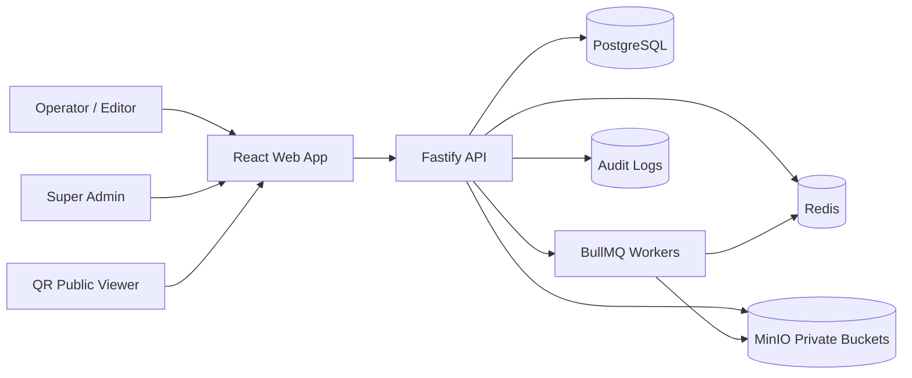
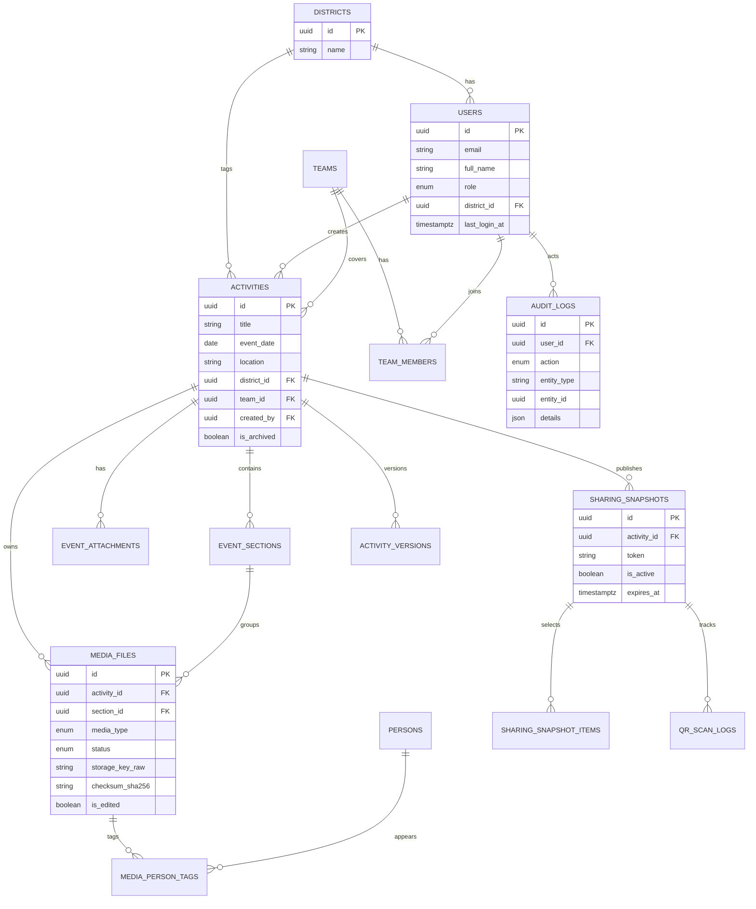
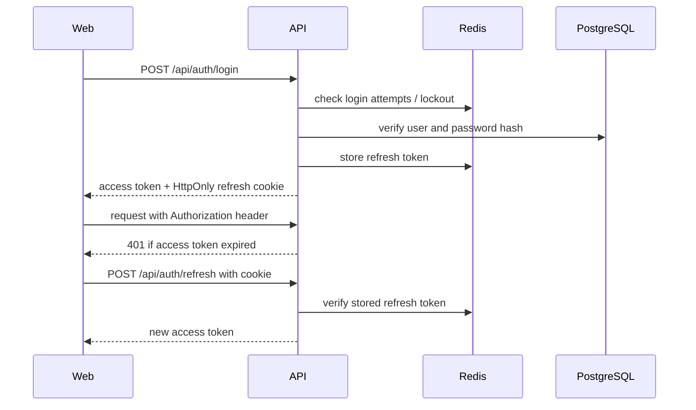
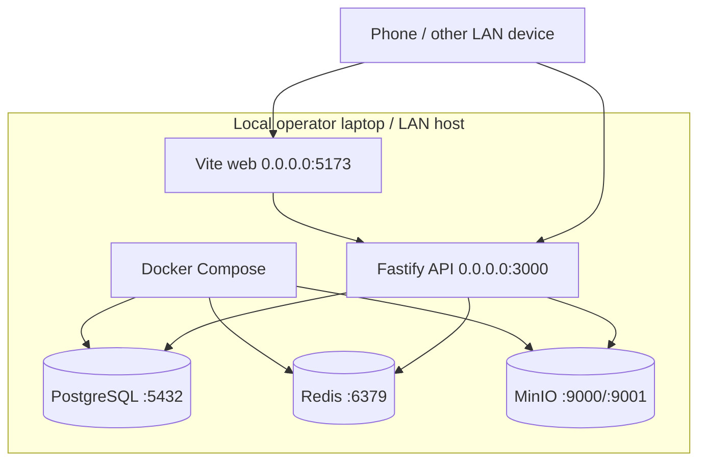
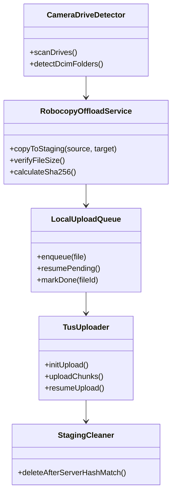

# REKAM Architecture

## System Context

```mermaid
flowchart LR
  Operator[Operator / Editor] --> Web[React Web App]
  Admin[Super Admin] --> Web
  Public[QR Public Viewer] --> Web
  Web --> API[Fastify API]
  API --> PG[(PostgreSQL)]
  API --> Redis[(Redis)]
  API --> MinIO[(MinIO Private Buckets)]
  API --> Queue[BullMQ Workers]
  Queue --> Redis
  Queue --> MinIO
  API --> Audit[(Audit Logs)]
```

## Core ERD

```mermaid
erDiagram
  DISTRICTS ||--o{ USERS : has
  DISTRICTS ||--o{ ACTIVITIES : tags
  USERS ||--o{ ACTIVITIES : creates
  TEAMS ||--o{ ACTIVITIES : covers
  TEAMS ||--o{ TEAM_MEMBERS : has
  USERS ||--o{ TEAM_MEMBERS : joins
  ACTIVITIES ||--o{ EVENT_SECTIONS : contains
  ACTIVITIES ||--o{ MEDIA_FILES : owns
  EVENT_SECTIONS ||--o{ MEDIA_FILES : groups
  ACTIVITIES ||--o{ EVENT_ATTACHMENTS : has
  MEDIA_FILES ||--o{ MEDIA_PERSON_TAGS : tags
  PERSONS ||--o{ MEDIA_PERSON_TAGS : appears
  ACTIVITIES ||--o{ SHARING_SNAPSHOTS : publishes
  SHARING_SNAPSHOTS ||--o{ SHARING_SNAPSHOT_ITEMS : selects
  SHARING_SNAPSHOTS ||--o{ QR_SCAN_LOGS : tracks
  ACTIVITIES ||--o{ ACTIVITY_VERSIONS : versions
  USERS ||--o{ AUDIT_LOGS : acts

  DISTRICTS {
    uuid id PK
    string name
  }
  USERS {
    uuid id PK
    string email
    string full_name
    enum role
    uuid district_id FK
    timestamptz last_login_at
  }
  ACTIVITIES {
    uuid id PK
    string title
    date event_date
    string location
    uuid district_id FK
    uuid team_id FK
    uuid created_by FK
    boolean is_archived
  }
  MEDIA_FILES {
    uuid id PK
    uuid activity_id FK
    uuid section_id FK
    enum media_type
    enum status
    string storage_key_raw
    string checksum_sha256
    boolean is_edited
  }
  SHARING_SNAPSHOTS {
    uuid id PK
    uuid activity_id FK
    string token
    boolean is_active
    timestamptz expires_at
  }
  AUDIT_LOGS {
    uuid id PK
    uuid user_id FK
    enum action
    string entity_type
    uuid entity_id
    json details
  }
```

## Auth Flow

```mermaid
sequenceDiagram
  participant Web
  participant API
  participant Redis
  participant DB as PostgreSQL

  Web->>API: POST /api/auth/login
  API->>Redis: check login attempts / lockout
  API->>DB: verify user and password hash
  API->>Redis: store refresh token
  API-->>Web: access token + HttpOnly refresh cookie
  Web->>API: request with Authorization header
  API-->>Web: 401 if access token expired
  Web->>API: POST /api/auth/refresh with cookie
  API->>Redis: verify stored refresh token
  API-->>Web: new access token
```

## Local Deployment

```mermaid
flowchart TB
  subgraph Laptop["Local operator laptop / LAN host"]
    WebDev[Vite web 0.0.0.0:5173]
    ApiDev[Fastify API 0.0.0.0:3000]
    Docker[Docker Compose]
    Docker --> PG[(PostgreSQL :5432)]
    Docker --> Redis[(Redis :6379)]
    Docker --> MinIO[(MinIO :9000/:9001)]
    WebDev --> ApiDev
    ApiDev --> PG
    ApiDev --> Redis
    ApiDev --> MinIO
  end

  Phone[Phone / other LAN device] --> WebDev
  Phone --> ApiDev
```

## Future Desktop Offload Target

```mermaid
classDiagram
  class CameraDriveDetector {
    +scanDrives()
    +detectDcimFolders()
  }
  class RobocopyOffloadService {
    +copyToStaging(source, target)
    +verifyFileSize()
    +calculateSha256()
  }
  class LocalUploadQueue {
    +enqueue(file)
    +resumePending()
    +markDone(fileId)
  }
  class TusUploader {
    +initUpload()
    +uploadChunks()
    +resumeUpload()
  }
  class StagingCleaner {
    +deleteAfterServerHashMatch()
  }

  CameraDriveDetector --> RobocopyOffloadService
  RobocopyOffloadService --> LocalUploadQueue
  LocalUploadQueue --> TusUploader
  TusUploader --> StagingCleaner
```
